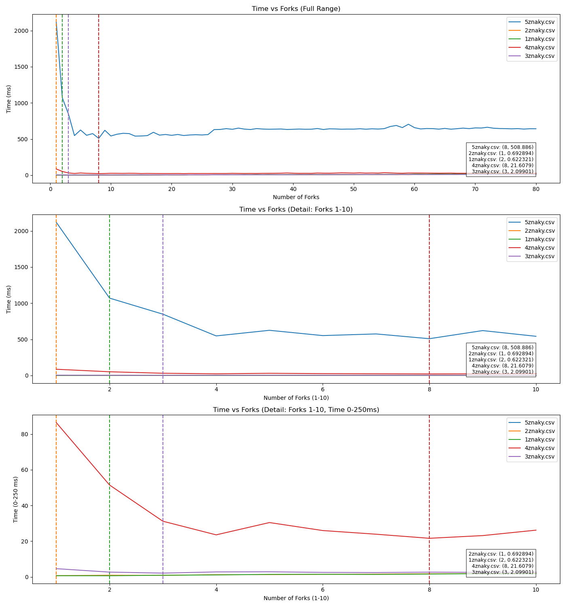

# Úkol 1 - Matěj Eliáš ELI0039

## Před spuštěním
Pro spuštění je třeba mít nainstalované
- Python 3.12 (pro generování grafu, **Je možné vynechat proces generovaní grafu pomocí makra v `src/main.cpp`**)
- nainstalovaná knihovna pandas
```
sudo apt install python3.12
sudo apt install python3-dev
sudo apt install python3-pandas
```

## Vynechání spouštění python scriptu pro generování grafu
V souboru `src/main.cpp` nastavte hodnotu makra `NO_PYTHON` na 1
```
#define NO_PYTHON 1 // Set this to 1
```
Případně můžete změnit verzi pythonu na vaši požadovanou verzi. Pak je třeba v `Makefile` změnit hodnoty `-I/usr/include/python3.12 ` a `-lpython3.12`

# Výsledek
- Výsledná data jsou uložená v `data/`.
- Výsledný graf je uložen v `data/result.png`.
- Log z běhu programu uložen pro délku 5 znaků a 80 forků uložen v `data/run.sh.5chars80forks.txt`

Výsledný [graf](data/result.png) (pokud existuje):

